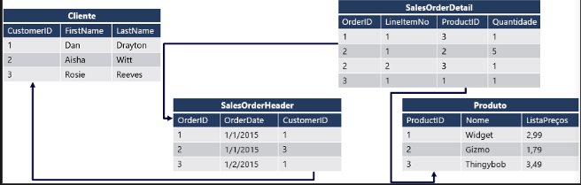

# Introdução ao Transact-SQL 

### Linguagem SQL
Structured Query Language é usado para se comunicar com banco de dados relacional. Alguns sistemas comuns de gerenciamento de banco de dados relacional que usam o SQL incluem Microsoft SQL Server, MySQL, PostgreSQL, MariaDB e Oracle.

### Transact-SQL
TSQL, ou T-SQL (abreviação de transaction-SQL), é uma versão aprimorada do SQL que contém algumas extensões. O TSQL foi originalmente desenvolvido pela Sybase e agora é propriedade da Microsoft.

O T-SQL adiciona alguns recursos avançados ao SQL para torná-lo mais poderoso, como variáveis declaradas, controle de transação, tratamento de erros e exceções, operações de string, processamento de data e hora, etc.

Sistemas de banco de dados da Microsoft, como SQL Server, Banco de Dados SQL do Azure, Azure Synapse Analytics e outros usam um dialeto do SQL chamado Transact-SQL ou T-SQL. O T-SQL inclui extensões de linguagem para escrever procedimentos e funções armazenados - que consistem em código de aplicativo armazenado no banco de dados - e para gerenciar contas de usuário.

Linguagens declarativas permitem que você descreva a saída que deseja e deixe para o mecanismo de execução os detalhes das etapas necessárias para produzir saída.
SQL é uma linguagem declarativa.

### Dados relacionais
UM=m BD relacional é aquele que os dados foram organizados em várias tabelas com linhas e colunas, onde cada linha representa um registro único e cada coluna representa um atributo dos dados.
Relacionamento entre tabelas são estabelecidos através de chaves primárias e estrangeiras.
Uma chave primária é definida para cada tabela e uma referência a essa chave é definida como uma chave estrangeira em qualquer outra tabela relacionada.

